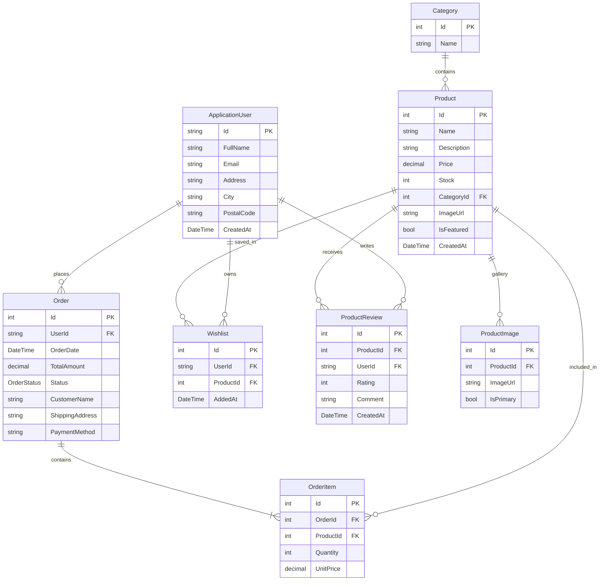

# 📚 Complete Technical Architecture & Codebase Guide

**Application Name**: Enterprise E-Commerce Management System  
**Production Domain**: `https://ecommercepro.com`  
**Technology Stack**: ASP.NET Core MVC (.NET 10 LTS), Entity Framework Core 10, SQL Server 2022, ASP.NET Core Identity, Bootstrap 5, Chart.js  

---

## 🧭 Executive Summary for Reviewers & Interviewers

This document provides an exhaustive, beginner-friendly file-by-file breakdown of the **Enterprise E-Commerce Management System**. Any developer, technical architect, or interviewer reading this document can fully understand the architecture, database schema, design decisions, and request execution flow of this application.

### Key Architectural Highlights
1. **Clean Layered MVC Architecture**: Separation of concerns between Data Models, ViewModels (DTOs), Controllers (Business Logic), and Razor Views (Presentation Layer).
2. **Entity Framework Core 10 Eager Loading**: Relational mapping with explicit Foreign Keys (`CategoryId`, `UserId`, `ProductId`, `OrderId`), navigation properties, and `.Include()` optimization to prevent the N+1 query problem.
3. **ASP.NET Core Identity Security**: Role-based access control (`Admin` and `User` roles), password hashing via PBKDF2 with HMAC-SHA256, anti-forgery token verification (`[ValidateAntiForgeryToken]`), and authorization guards (`[Authorize]`).
4. **Session-Based Cart State**: Lightweight JSON session serialization for instant user cart response without database clutter.
5. **Real-time Analytics**: Admin dashboard powered by LINQ aggregation queries and interactive Chart.js visualizations.

---

## 📐 System Architecture & Request Execution Flow

```
[ Client Browser ] ---> (https://ecommercepro.com)
       │
       ▼
[ ASP.NET Core MVC Pipeline ]
 ├── HTTPS Redirection Middleware
 ├── Static File Middleware (wwwroot images, css, js)
 ├── Routing Middleware
 ├── Authentication Middleware (Identity Cookie Check)
 ├── Authorization Middleware ([Authorize] Guard Evaluation)
 └── Session Middleware (Cart State Retrieval)
       │
       ▼
[ Controller Action Execution ] (e.g. ProductController, OrderController)
       │
       ▼
[ ApplicationDbContext ] ---> [ SQL Server 2022 Database ]
       │
       ▼
[ ViewModels Binding ] ---> [ Razor Engine View Rendering ] ---> [ HTML Response to Client ]
```

---

## 🗄️ Database Entity Relationship (ER) Diagram



---

## 📁 File-by-File Technical Breakdown

### 1. Data Models (`Models/`)

#### 📄 `Models/Category.cs`
- **Purpose**: Defines the Category entity for grouping products (e.g. Electronics, Fashion, Home).
- **Key Properties**: `Id` (PK), `Name` (Required, Max 50 chars), `Products` (Collection Navigation Property).
- **Why it exists**: Enables 1-to-Many relationship where one Category contains multiple Products.

#### 📄 `Models/Product.cs`
- **Purpose**: Defines the core Product domain model.
- **Key Properties**: `Id` (PK), `Name`, `Description`, `Price` (decimal 18,2), `Stock`, `CategoryId` (FK), `Category` (Reference Navigation), `ImageUrl`, `IsFeatured`, `Images`, `OrderItems`, `Wishlists`, `Reviews`.
- **Why it exists**: Represents products available for purchase on `https://ecommercepro.com`.

#### 📄 `Models/ProductImage.cs`
- **Purpose**: Manages multi-image galleries for individual products.
- **Key Properties**: `Id`, `ProductId` (FK), `ImageUrl`, `IsPrimary`.

#### 📄 `Models/ApplicationUser.cs`
- **Purpose**: Extends ASP.NET Core `IdentityUser` with enterprise profile fields.
- **Key Properties**: `FullName`, `Address`, `City`, `PostalCode`, `CreatedAt`, `Orders`, `Wishlists`, `Reviews`.

#### 📄 `Models/Order.cs` & `Models/OrderItem.cs`
- **Purpose**: Captures customer order placements and line-item snapshots.
- **Key Properties in Order**: `Id`, `UserId` (FK), `OrderDate`, `TotalAmount`, `Status` (`OrderStatus` Enum), `CustomerName`, `ShippingAddress`, `PaymentMethod`.
- **Key Properties in OrderItem**: `Id`, `OrderId` (FK), `ProductId` (FK), `Quantity`, `UnitPrice`.

#### 📄 `Models/OrderStatus.cs`
- **Purpose**: Enum defining order state lifecycle: `Pending`, `Processing`, `Shipped`, `Delivered`, `Cancelled`.

#### 📄 `Models/CartItem.cs`
- **Purpose**: In-memory / Session object representing items in the user's active shopping cart prior to checkout.

#### 📄 `Models/Wishlist.cs`
- **Purpose**: Links `ApplicationUser` to `Product` for bookmarking favorite items.

#### 📄 `Models/ProductReview.cs`
- **Purpose**: Stores verified customer star ratings (1 to 5) and textual feedback for products.

#### 📄 `Models/PaginatedList.cs`
- **Purpose**: Generic LINQ pagination utility using `.Skip()` and `.Take()` to handle large dataset pagination efficiently.

---

### 2. ViewModels (`Models/ViewModels/`)

- 📄 **`RegisterViewModel.cs`**: Form validation DTO for user account creation.
- 📄 **`LoginViewModel.cs`**: Credentials DTO for authentication (`Email`, `Password`, `RememberMe`).
- 📄 **`CartViewModel.cs`**: Encapsulates list of `CartItem` objects and calculates `GrandTotal`.
- 📄 **`CheckoutViewModel.cs`**: Combines customer shipping address fields with current `CartViewModel`.
- 📄 **`DashboardViewModel.cs`**: Contains metrics (Total Revenue, Orders, Products, Categories, Users) and Chart.js datasets.
- 📄 **`ProductFilterViewModel.cs`**: Holds search term, category filter, price filters, sort order, and paginated product list.
- 📄 **`ReportViewModel.cs`**: Data container for monthly sales breakdowns and top-selling products rankings.

---

### 3. Data Context (`Data/`)

#### 📄 `Data/ApplicationDbContext.cs`
- **Inheritance**: Inherits `IdentityDbContext<ApplicationUser>` to combine ASP.NET Core Identity authentication tables with custom e-commerce tables.
- **DbSets**: `Products`, `Categories`, `ProductImages`, `Orders`, `OrderItems`, `Wishlists`, `ProductReviews`.
- **OnModelCreating**: Configures foreign key constraints, cascade delete behaviors (`DeleteBehavior.Restrict` on Categories to prevent orphan products, `DeleteBehavior.Cascade` on OrderItems).

---

### 4. Controllers (`Controllers/`)

#### 📄 `Controllers/AccountController.cs`
- **Actions**: `Register`, `Login`, `Logout`, `AccessDenied`.
- **Logic**: Uses `UserManager<ApplicationUser>` and `SignInManager<ApplicationUser>` for cookie authentication and role assignment (`User` role by default).

#### 📄 `Controllers/CategoryController.cs`
- **Security**: Guarded by `[Authorize(Roles = "Admin")]`.
- **Actions**: `Index`, `Create`, `Edit`, `Delete`, `DeleteConfirmed`.
- **Validation**: Checks if a category has linked products before allowing deletion, preventing SQL FK constraint exceptions.

#### 📄 `Controllers/ProductController.cs`
- **Security**: Guarded by `[Authorize(Roles = "Admin")]`.
- **Actions**: `Index`, `Create`, `Edit`, `Details`, `Delete`, `DeleteImage`.
- **Features**: Eager loading with `.Include(p => p.Category)`, dropdown populating via `SelectList`, primary image file upload, multi-image gallery file handling.

#### 📄 `Controllers/HomeController.cs`
- **Actions**: `Index` (Storefront catalog), `Details` (Product page), `AddReview` (Customer rating submission).
- **Features**: Multi-column search, category dropdown filter, price range filtering, LINQ sorting, featured product banner.

#### 📄 `Controllers/CartController.cs`
- **Actions**: `Index`, `AddToCart`, `UpdateQuantity`, `RemoveFromCart`, `ClearCart`.
- **Session Management**: Serializes/Deserializes `List<CartItem>` into JSON stored in `HttpContext.Session`.

#### 📄 `Controllers/OrderController.cs`
- **Actions**: `Checkout` (GET/POST), `Confirmation`, `Index` (My Orders), `Details`, `Invoice` (Printable receipt), `AdminOrders` (Admin order status update).
- **Transaction**: Converts cart items to `OrderItems`, deducts stock from `Products`, saves `Order`, and clears session cart.

#### 📄 `Controllers/AdminController.cs`
- **Security**: Guarded by `[Authorize(Roles = "Admin")]`.
- **Actions**: `Index` (Calculates revenue, product counts, recent activities, and Chart.js datasets).

#### 📄 `Controllers/WishlistController.cs`
- **Actions**: `Index`, `ToggleWishlist`, `Remove`.

#### 📄 `Controllers/ReportsController.cs`
- **Security**: Guarded by `[Authorize(Roles = "Admin")]`.
- **Actions**: `Index` (Analytics dashboard), `ExportCsv` (Generates downloadable CSV sales report).

---

### 5. Infrastructure & Configuration

#### 📄 `Program.cs`
- **Services Registered**: MVC Controllers with Views, SQL Server DbContext, ASP.NET Core Identity, Application Cookie options, Session state cache.
- **Middleware Pipeline**: Static files, Routing, Authentication, Authorization, Session.
- **Database Seeder**: Applies migrations automatically on app startup, seeds `Admin` and `User` roles, creates default admin user (`admin@ecommerce.com`), and inserts 8+ rich sample products across 4 categories.

#### 📄 `appsettings.json`
- Stores connection strings (`DefaultConnection` targeting `SQL Server 2022 Express`) and domain metadata (`https://ecommercepro.com`).

---

## 💡 How to Demonstrate This Project to an Interviewer

1. **Architecture Overview**: Explain that the application uses ASP.NET Core MVC on .NET 10 LTS with Entity Framework Core 10 and SQL Server 2022.
2. **Database Design**: Point to the Mermaid ER Diagram showing the relationships (`Category 1-to-Many Product`, `Order 1-to-Many OrderItem`, `Product 1-to-Many ProductImage`).
3. **ORM Performance**: Explain how eager loading (`.Include(p => p.Category)`) avoids the N+1 query problem.
4. **Security**: Mention ASP.NET Core Identity role-based authorization (`[Authorize(Roles = "Admin")]`), PBKDF2 password hashing, and anti-forgery protection.
5. **Live Features**: Demonstrate the storefront at `https://ecommercepro.com`, shopping cart, checkout invoicing, Chart.js admin dashboard, and CSV report export.
