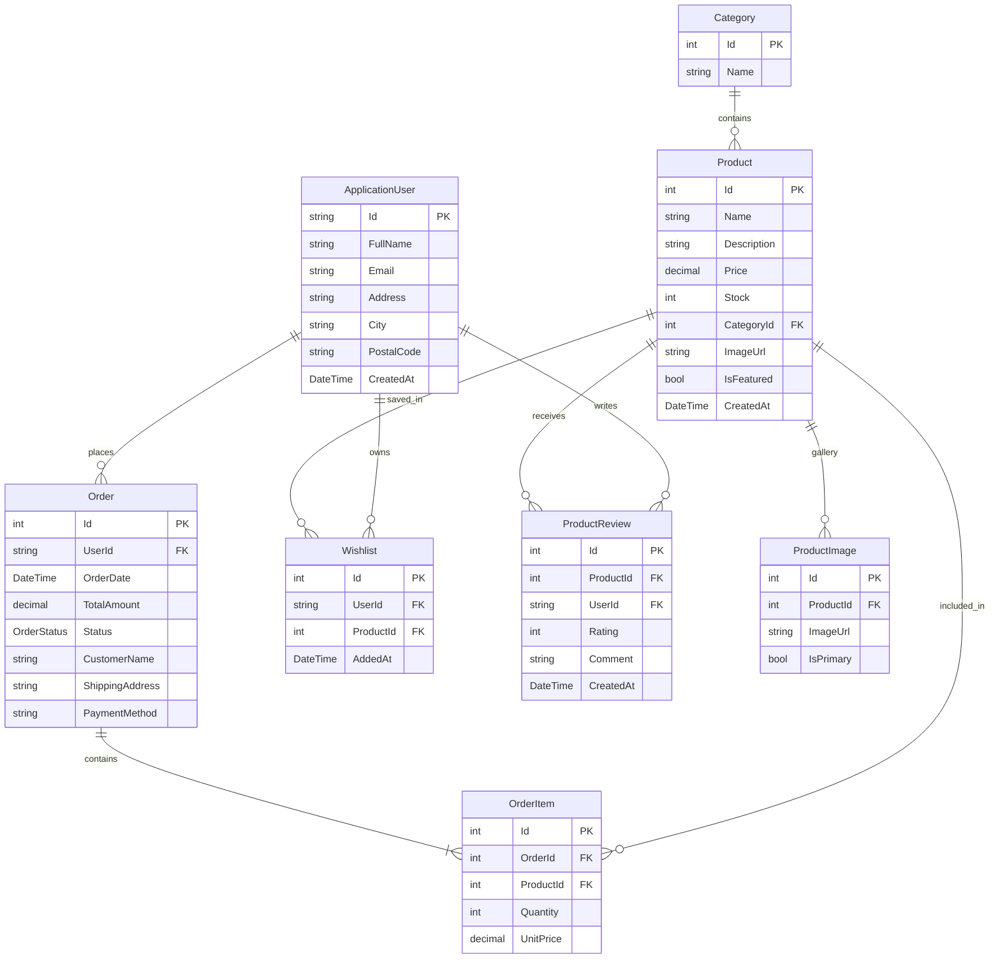

# 🛍️ Enterprise E-Commerce Management System (.NET 10 LTS)

[]()
[]()
[]()
[]()
[]()

A full-stack, production-ready enterprise E-Commerce Management System engineered with **ASP.NET Core MVC (.NET 10 LTS)**, **Entity Framework Core 10**, **SQL Server 2022**, **ASP.NET Core Identity**, and **Bootstrap 5**. Designed with clean architecture, enterprise security patterns, and robust domain models.

---

## 📸 Product Catalog & Auto-Seeded Data

The system includes automatic database migrations and data seeding on launch. When you start the application, the database is pre-populated with enterprise sample products across 4 categories:

- 📱 **Electronics**: Flagship 5G Smartphone, Noise-Canceling Headphones, Ultra-Thin Developer Laptop
- 👞 **Fashion & Apparel**: Classic Genuine Leather Oxford Shoes, Waterproof Chronograph Watch
- ☕ **Home & Kitchen**: Smart Espresso Machine, Ergonomic Mesh Executive Chair
- 📚 **Books & Stationery**: The Clean Architecture Guide Book

---

## 📐 System Architecture & Design Patterns

```
[ Browser / Client ] 
        │ 
        ▼
[ ASP.NET Core MVC Middleware Pipeline ] (Authentication, Routing, Session)
        │
        ▼
[ Controllers Layer ] (Account, Product, Category, Order, Cart, Admin, Reports)
        │
        ▼
[ ViewModels Layer ] (Strongly-typed DTOs & Form Bindings)
        │
        ▼
[ Data Layer / ApplicationDbContext ] (EF Core 10 ORM)
        │
        ▼
[ SQL Server 2022 Express Database ]
```

---

## 🗄️ Database Entity Relationship (ER) Diagram



---

## ✨ Features Checklist

| Module | Features Implemented |
| :--- | :--- |
| **Phase 1 - 3.5** | ✅ Project Setup, SQL Connection, EF Core, Product & Category CRUD, FK Relationships |
| **Phase 3.6** | ✅ Eager Loading (`Include()`), Category Dropdowns (`SelectList`), Category Delete FK Validation |
| **Phase 4** | ✅ ASP.NET Core Identity, Register/Login/Logout, Role Authorization (`Admin`/`User`), Password Hashing |
| **Phase 5** | ✅ Executive Admin Dashboard, Telemetry Cards, Recent Activity Tables, Chart.js Visualizations |
| **Phase 6** | ✅ Session Shopping Cart, Add/Remove/Update Quantity, Navbar Badge Counter |
| **Phase 7** | ✅ Order Placement, Stock Deduction, Customer Order History, Printable Invoice, Admin Status Management |
| **Phase 8** | ✅ Cover Image Upload, Multi-Image Gallery Management, Image Deletion Preview |
| **Phase 9** | ✅ Multi-field Search, Category Filter, Price Range Filtering, LINQ Sorting, Generic `PaginatedList<T>` |
| **Phase 10** | ✅ Customer Wishlist Toggle, Product Star Ratings (1-5), Verified Customer Reviews |
| **Phase 11** | ✅ Enterprise Bootstrap 5 Theme, Responsive Layout, Toast Notifications (`TempData`), Custom Error Pages |
| **Phase 12** | ✅ Monthly Sales Analytics, Top Products Ranking, CSV Data Export |

---

## 🛠️ Prerequisites & Local Setup Guide

### 1. Clone Repository
```bash
git clone https://github.com/<your-username>/<your-repo-name>.git
cd ECommerceManagementSystem
```

### 2. Configure Database Connection String
In [appsettings.json](file:///c:/Users/Prathamesh%20%20Shinde/Downloads/ECommerceManagementSystem/appsettings.json), update the connection string to match your local SQL Server instance:
```json
"ConnectionStrings": {
  "DefaultConnection": "Server=YOUR_SERVER_NAME;Database=ECommerceDb;Trusted_Connection=True;TrustServerCertificate=True;MultipleActiveResultSets=true"
}
```

### 3. Build & Run Application
```bash
dotnet restore
dotnet build
dotnet run
```

Navigate to `https://ecommercepro.com` (or your configured application URL). The database tables and seed products will automatically populate on application startup!

---

## 📄 License
This project is licensed under the MIT License — built for educational and enterprise portfolio purposes.
